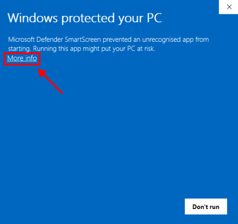
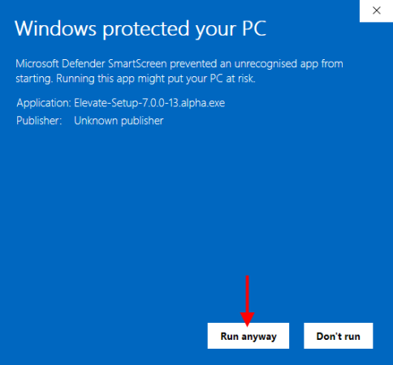

- <a href="https://github.com/thomaschampagne/elevate/releases/download/7.2.0/Elevate-Setup-7.2.0.exe" target="_blank">Download app</a> from github (<a href="https://www.virustotal.com/gui/file/07c6a50e38100d4820dfbf31b2c54cea54fd794f4c61bd30af28019de81437aa?nocache=1" target="_blank">check security report</a>)
- Install Elevate.
- After Launching Elevate, you should below warning, It's normal... Click `More info`

> 

✔️ Elevate is safe. You get this because the application does not come yet with a trusted (=paid) certificate.

- Then click `Run anyway` on this next screen:

> 

- You're done
