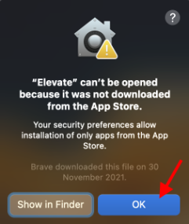
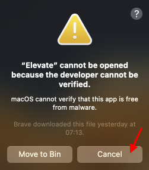
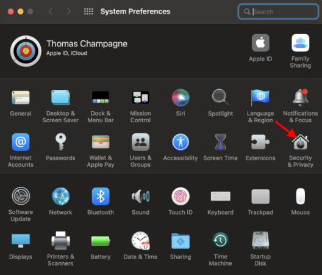
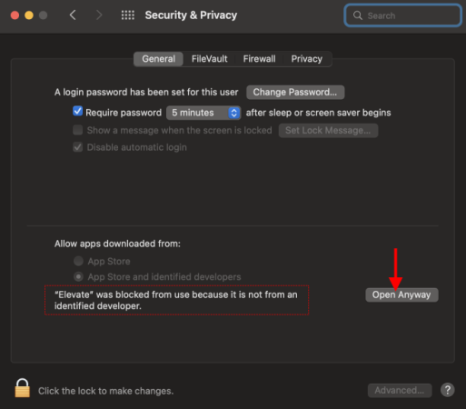
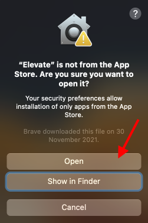
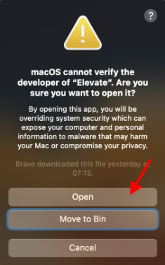

- Download the <a href="https://github.com/thomaschampagne/elevate/releases/latest" target="_blank">latest version "Elevate-x.x.x-universal.dmg" file</a> from github (<a href="https://www.virustotal.com/gui/file/ba639ce514710e6a2d57c57417d0c6631008298d5f3804846b482b32ae7f8df9" target="_blank">check security report</a>)
- Open **.dmg** file, then drag and drop Elevate into your apps.
- After Launching Elevate, you should get one of below warnings, It's normal... Just click `Cancel` or `Ok`

> 
> 

✔️ Elevate is safe. You get that because app is not signed yet with an Apple developer paid subscription. <a href="https://support.apple.com/guide/mac-help/open-a-mac-app-from-an-unidentified-developer-mh40616/mac" target="_blank">(Apple explanations)</a>

- Open the `System preferences` and click `Security & Privacy`:

> 

- Then click `Open Anyway`:

> 

- You should get one these warnings, just click `Open`

> 
> 

- You're done
