

  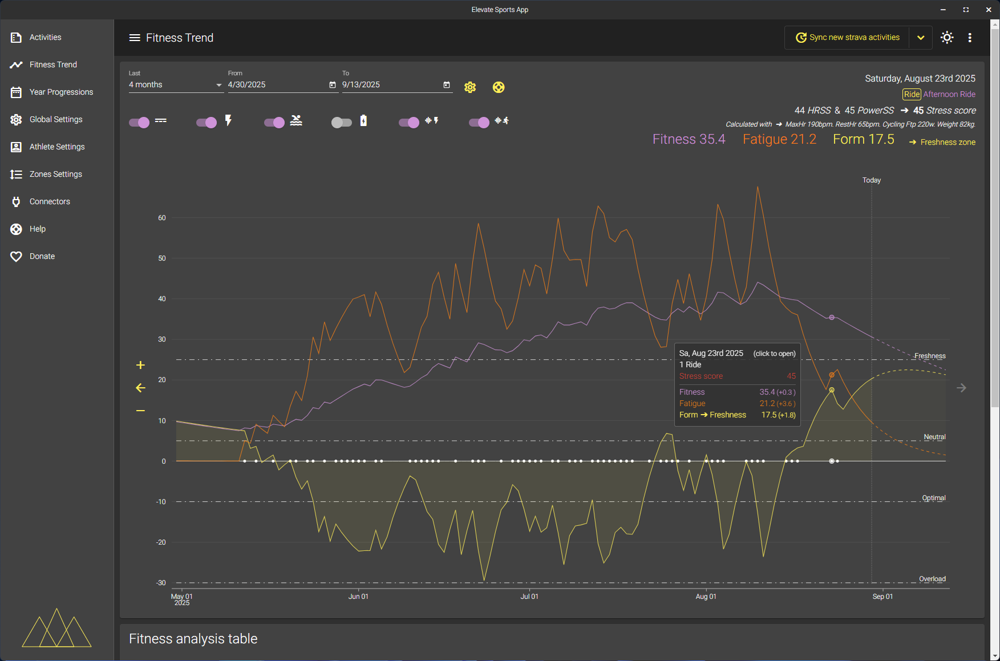
   
  <em>Track your long-term fitness trend and performance improvements visually.</em>

  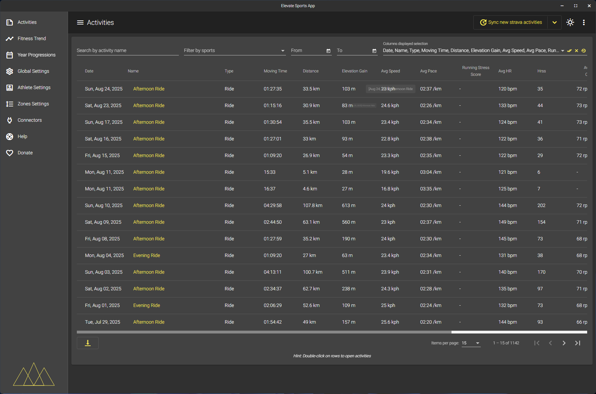
   
  <em>Browse and filter your recorded rides with summary statistics for each activity.</em>

  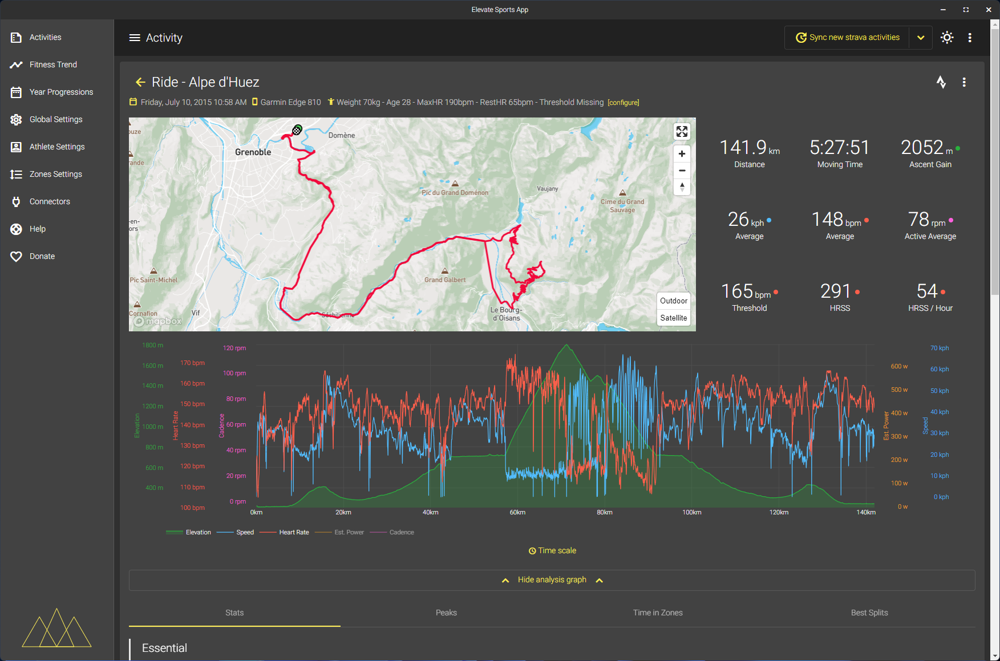
   
  <em>Review in-depth ride details including map and core metrics for every session.</em>

  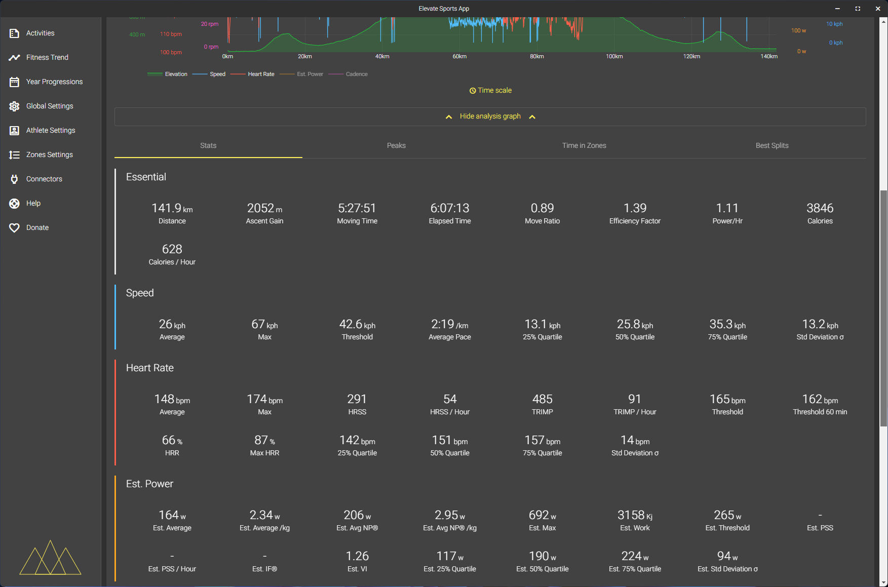
   
  <em>View essential ride stats including averages and highlight metrics for each activity.</em>

  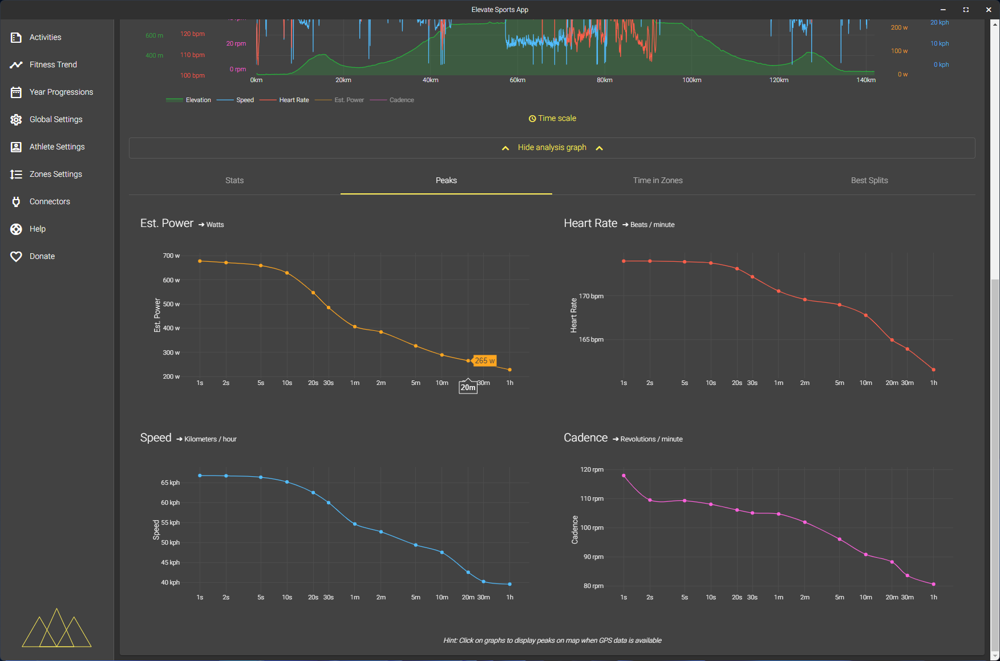
   
  <em>See peak values for power, heart rate, speed, and cadence across your ride.</em>

  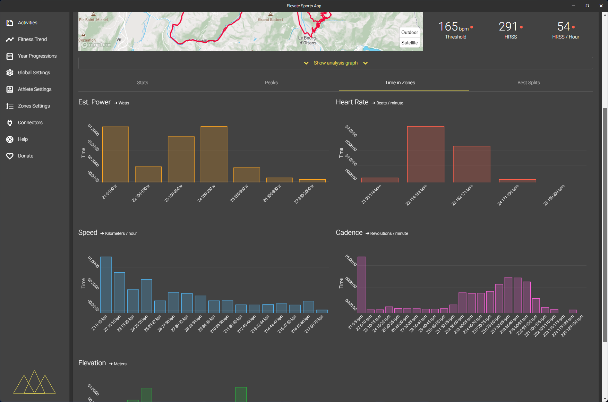
   
  <em>Explore how much time was spent in various heart rate, power, and cadence zones during a ride.</em>

  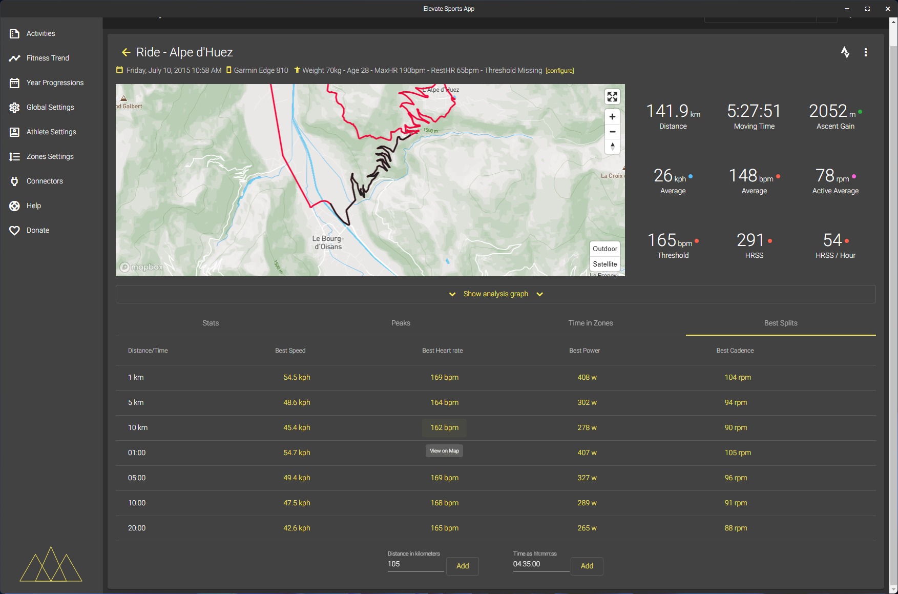
   
  <em>Analyze best splits and key segment statistics like fastest speeds and highest cadence.</em>

  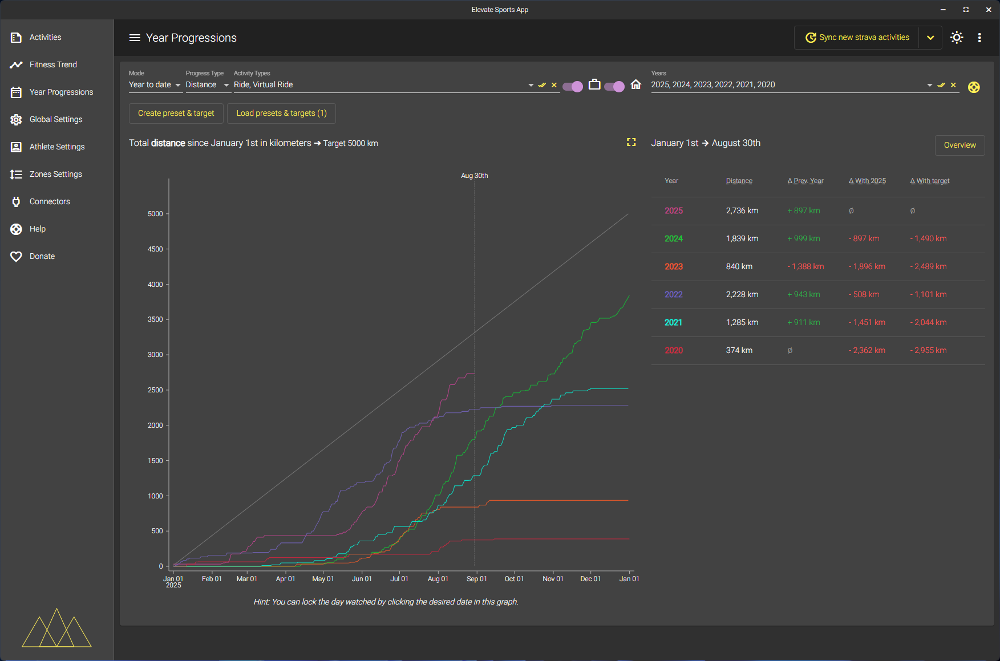
   
  <em>Monitor your yearly progression with cumulative activity and training volume charts.</em>

  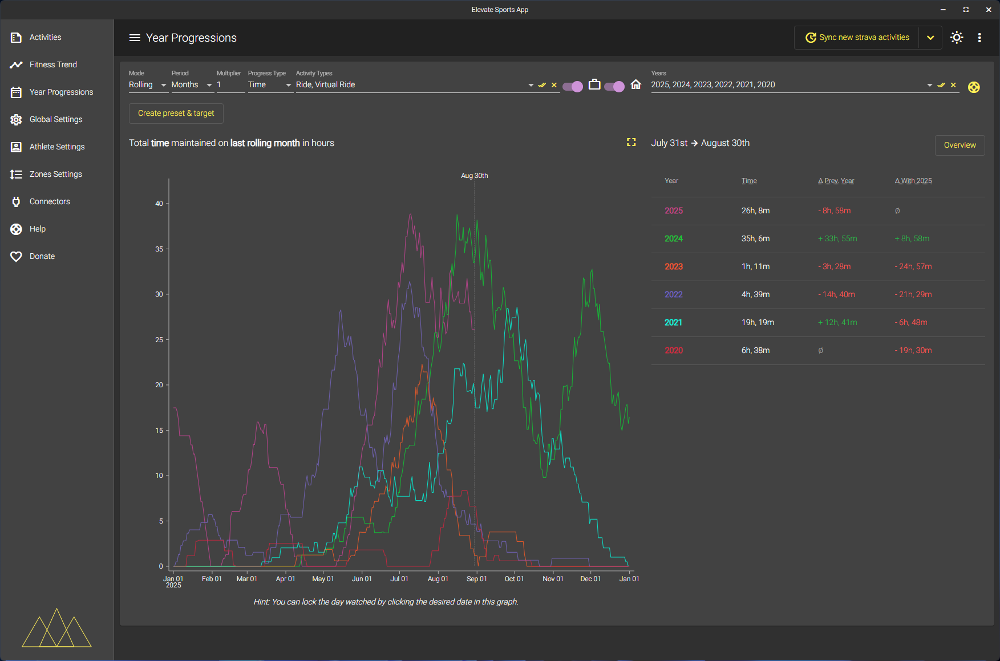
   
  <em>Visualize rolling training volume and track period-over-period improvements.</em>

  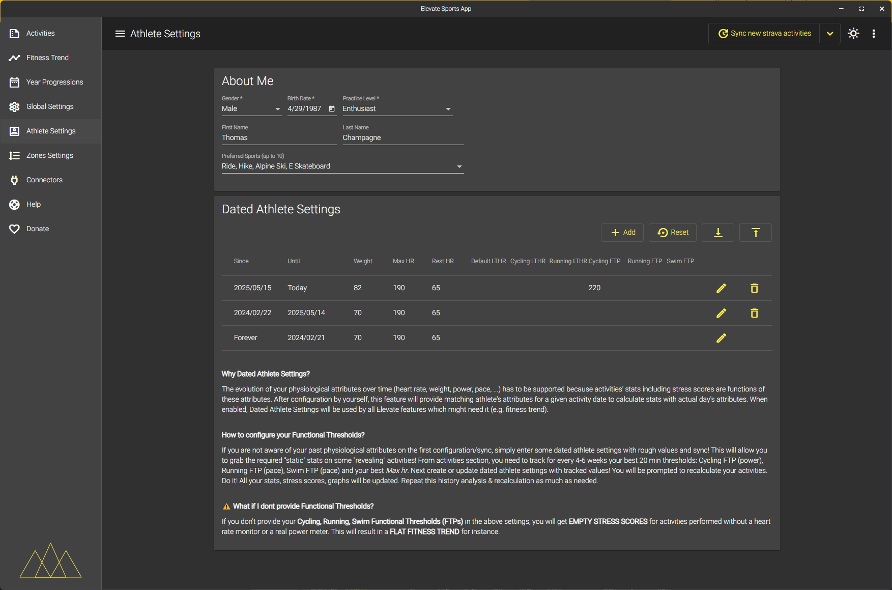
   
  <em>Adjust personal data, physical metrics, and measurement preferences over time.</em>

  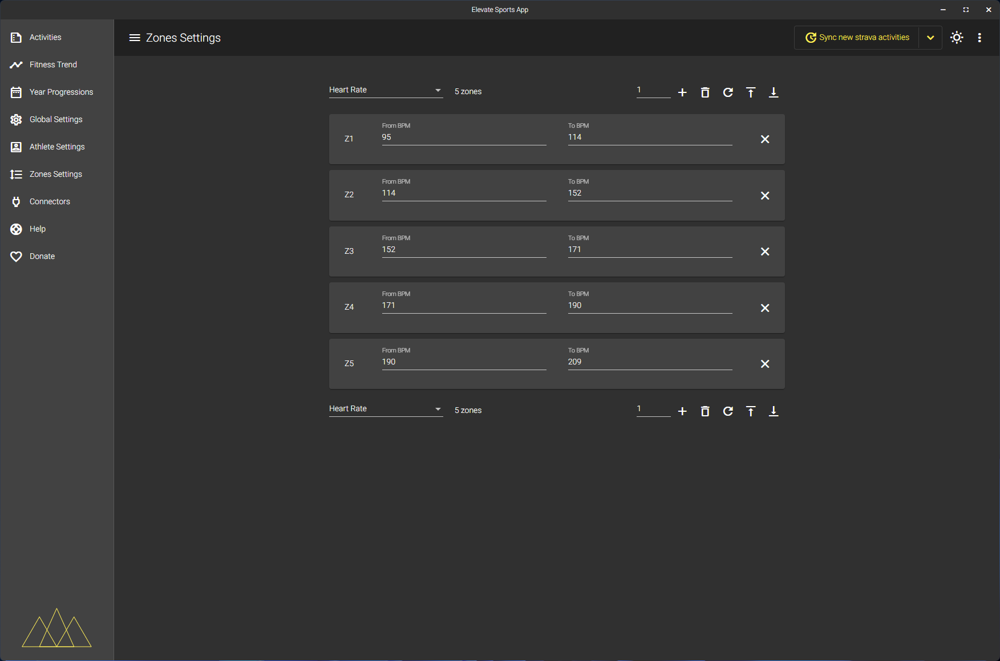
   
  <em>Customize your training zones for heart rate, power, and cadence.</em>

  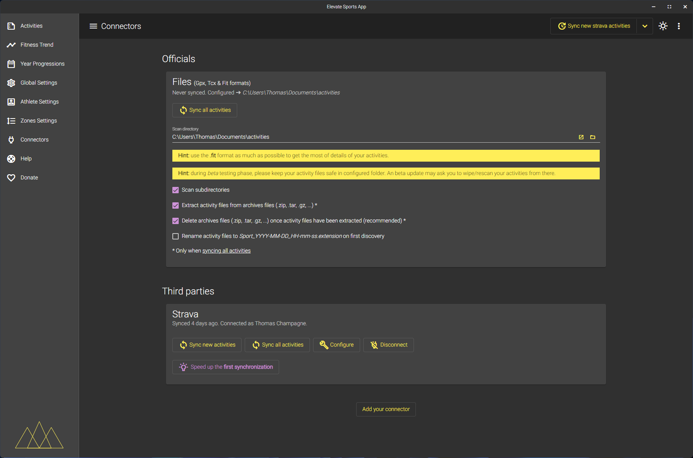
   
  <em>Manage integrations with external services and sync activities easily.</em>

